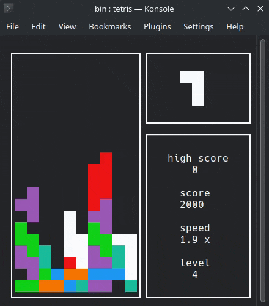

 # BrickGame_v1.0

  

 ## Game Description  
 "Brick Game" is a version of the classic "Tetris" game.  
 Control the tetramino with the arrow keys.  
 ==Enter== - start new game.  
 ==Space== - rotate the tetramino.  
 '==P==' - pause.  
 '==Q==' - quit the game.  

 ## Getting Started  
 The program is built using a Makefile.  

* `make install` - Compile the game into the 'install' directory  
* `make uninstall` - Remove the program  
* `make dvi` - Compile the documentation  
* `make run_dvi` - Run the documentation  
* `make dist` - Archive the project  
* `make test` - Run unit tests  
* `make gcov_report` - Generate a gcov report as an HTML page  
* `make cppcheck` - Run cppcheck utility  
* `make clean` - Remove unnecessary files  

 ## Contact  
 - Telegram: @winifrst  